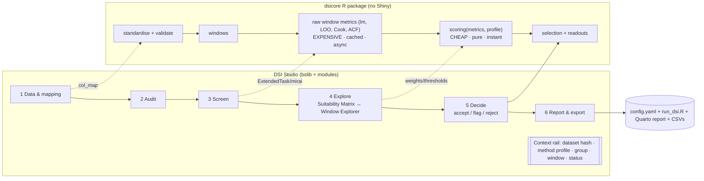

# DSI Studio: proposal for an interactive screening app

*For Javier Porobic, 6 Oct 2026 (AEDT). Based on `REVIEW.md`, the DSI report and the example data. The design is generic and assumes no fixed species, fleets, column names or region.*

## 1. Position: a decision instrument, not a dashboard

DSI answers one question: **which window of which stock unit can I give to a production model, and can I defend that choice?** A sidebar with tabs of plots would show the numbers without helping anyone decide. DSI Studio is built around the decision instead:

- a **linear, guided story**: Data → Audit → Screen → Explore → Decide → Report;
- a **persistent context rail** that keeps the evidence visible;
- **progressive disclosure**, so the ~40 tunable constants never hit a new user all at once.

There are two audiences. A **workshop participant** (e.g. at an FAO meeting) needs defaults, plain language and a defensible output. An **analyst** needs to see every component, change every constant and export reproducible code.

## 2. Workflow and information architecture

**Navigation.** A horizontal step bar sits at the top; steps unlock as their prerequisites are met. Going back is free; downstream results that a change invalidates are marked "stale". There are no tabs inside steps; each step is one composed canvas.

**Context rail** (always on the left, about 260 px):
- dataset name and content hash;
- column mapping summary;
- method profile (*Report v1 (legacy)*, *Corrected*, or *Custom*, see §5);
- the active group and window;
- a live DSI / DSI_v2 readout with its band;
- a decision ledger counter ("12 of 47 groups decided").

## 3. Views

**1. Data & mapping.**
- Load CSV, XLSX or Parquet.
- An auto-guessing mapper turns columns into roles: `year | date`, `species`, `fleet` (optional), `catch`, `effort`, `cpue`, or *derive CPUE = catch/effort*.
- An **effort semantics** choice: "effort is per fleet-year, shared across species", "per group-year", or "per row".

That last choice fixes the review's most serious problem (finding §6.1). Choosing "shared" while the values disagree is flagged and blocked.

**2. Audit.** A data-quality report you can act on: a coverage grid (group × year, coloured by usable / NA CPUE / NA effort / absent), duplicates, years out of order, conflicting effort, CPUE ≠ catch/effort, and **trailing missing CPUE** (in the example data, 2019–2023 is missing for nearly every group). Each finding comes with a one-click fix and a note in the report, e.g. "anchor windows at last usable year", "aggregate effort by mean", "drop group".

**3. Screen.** Window settings (min_n, max_n; anchored or **free start × end**), then Run. A progress strip fills group by group (ExtendedTask). Profile presets cover most needs; the 40 constants sit in an "Advanced" drawer, grouped by component, each with a short "what this does" line and its default shown.

**4. Explore** (the core of the app) has two coupled surfaces.

- **Suitability Matrix.** Rows are species and columns are fleets. With a single grouping dimension it becomes a column. Each cell shows a **score-by-start-year sparkline** drawn on faint band backgrounds; the cell tint is the best score; a glyph marks READY (●), eligible but unstable (◐) or invalid (○), with the main reason on hover. Rows and columns sort by best score, coverage or name. One view replaces the faceted PNGs and the degenerate heatmap.
- **Window Explorer**, for the group under focus, with linked brushing:
  - (a) catch / effort / CPUE series with a **draggable window brush**;
  - (b) the score profile against start year (with free windows, a real start × end triangle heatmap);
  - (c) a **multiplicative waterfall** from DSI_base components through P_out, P_miss, P_inf, S_stab and S_fitE to DSI_v2, showing exactly where points were lost;
  - (d) diagnostics: ln CPUE against E with the fit, standardised residuals, Cook's D, leverage, the jackknife β strip and residual ACF.

  Brushing years in (a) highlights the same points in (d). Clicking a point in (d) ("what if 1998 were excluded?") recomputes that one window on the spot.

**5. Decide.** For each group: accept the suggested window, pick another, flag or reject, with an optional rationale. The suggested window comes from `select_best_window_per_species` logic. Selection should run per **group**, not pooled across fleets; that is an open question. The ledger becomes an auditable table.

**6. Report & export.** Covered in §7.

## 4. Plain-language interpretation

Each window and group gets a **readout generated by rules from the metrics** (deterministic, not an LLM), for example:

> "**Demersal, 1998–2024: DSI_v2 70 (Good, only just).** 27 usable years. CPUE falls as effort rises (β < 0, p = 0.01); effort spans 1.4× its mean and CPUE 2.4×. The biggest loss is the outlier penalty: **one** year with |std. residual| > 2 costs 19 % (P_out = 0.81); without it the score would be 86. The ranking is stable (top 3 windows within 2.3 points). ⚠ Effort for this group was replaced by another group's effort; check the mapping."

*(Real values from the example run under the legacy profile.)*

The templates are tied to actual fields: `reasons_invalid`, `selection_reason`, which component has the largest marginal loss in the waterfall, `f_beta_pos`, `spread`.

There are also **method warnings** for things the index cannot see:
- "CPUE is catch/effort, so a negative slope is expected even with no signal (see null test)";
- "effort was shared across groups";
- "the last 5 years are unusable".

A **null-model test** is optional: permute catch, or simulate C independent of E, and report where the observed DSI falls in that distribution. That turns the spurious-slope weakness (finding §6.3) into something you can see.

## 5. Method profiles: honest about versions

Profiles keep the user's science as the baseline:
- ***Report v1 (legacy)*** reproduces the current scripts exactly, quirks included (this is the regression baseline);
- ***Corrected*** fixes the confirmed bugs: per-group effort, rows sorted before the ACF, coverage counted on calendar years, a working stability filter, anchoring at the last usable year, and removing or replacing S_fitE;
- ***Custom*** is any user edit.

A **"compare profiles"** toggle shows both in the matrix (split cells) so changes can be explained in a meeting. The profile name and hash appear on every figure and export.

## 6. Visual design

**Typography.** IBM Plex Sans for UI and text; IBM Plex Mono with tabular figures for every number, so scores line up in tables and the rail. Fonts are bundled, not loaded from a CDN, because workshops are often offline.

**Score colour.** Keep the warm → cool order users know from the red/orange/yellow/green zones, but make it sound:
- Bands follow the **report's canonical cut-points (< 50 Poor, 50–70 Moderate, ≥ 70 Good)**, which can be changed, with an optional finer 25-point layer.
- Hues come from **Okabe–Ito** (vermillion `#D55E00`, orange `#E69F00`, bluish-green `#009E73`), adjusted in HCL so lightness is monotonic and the ramp holds up under deuteranopia and protanopia.
- Continuous scores use a perceptually uniform sequential HCL ramp between those anchors, never the RdBu diverging scale, since DSI has no meaningful midpoint.
- Band is always **double-encoded**: colour plus a text label or glyph.

**Categorical colour.** Score bands own hue, so fleets must not compete with them: fleets use a muted, separate qualitative palette plus shapes and line types, and are never drawn on band-coloured backgrounds at full saturation. Band backgrounds sit at 8–10 % tint.

**Layout.** A calm near-white canvas with a slate ink scale and one accent colour for interaction (focus, brush). 

**Projector mode.** Larger type and stronger contrast.

**Static figures.** Exports use one `theme_dsi()`: the three duplicated `theme_report()` copies, unified.

## 7. Reproducibility

A single **Export bundle** (zip) contains:
- `dsi_config.yaml`: mapping, effort semantics, profile and every constant, plus dataset hash, package versions and timestamp;
- a generated `run_dsi.R` that calls `dsicore` with that config and reproduces every number without the app;
- CSVs matching today's schema (`dsi_all_windows.csv`, `dsi_best_window_selected.csv`, and the decision ledger with rationales);
- a **Quarto report** (HTML/PDF/DOCX) with the method summary (aligned with the report qmd), audit findings, matrix, per-group explorer figures, readouts and decisions.

Loading a config restores the exact session.

## 8. Technical approach

**Separate the computation into `dsicore`**, a plain R package with no Shiny:
- `standardise()`, `audit()`, `windows()`;
- `window_metrics()`, which returns *raw* quantities only (β, p, EC, IC, n, ρ, f_out, f_cook, f_lev, acf1, z, jackknife βs);
- `score(metrics, profile)`, a pure, vectorised function with every constant in `profile`;
- `select()`, `readout()`, `null_test()`.

Today the s_* scaling is buried inside `compute_window_metrics`. Moving it into `score()` means changing weights or thresholds **re-scores thousands of windows in milliseconds without refitting**: sliders feel live, and sensitivity analysis is cheap. Test it with testthat: golden tests against the user's current outputs (legacy profile), property tests (scores always in [0,1], independent of row order), and the synthetic cases in `run/checks.R`.

**App structure.** A **golem** package (`dsiapp`), with one Shiny module per step plus `mod_context_rail`, `mod_matrix` and `mod_explorer`. I prefer golem to rhino here because the users are R scientists who install packages, and golem keeps everything in R-package conventions (testthat, `R CMD check`, pkgdown). Rhino's JS/Sass toolchain buys little once bslib handles the Sass.
- UI: **bslib / Bootstrap 5** with `page_fillable`, a custom Sass layer (tokens for type scale, ink, band colours; `bs_add_rules`) and `_brand.yml`.

**Widgets.** Chosen deliberately:
- **echarts4r** for the Window Explorer: canvas rendering, native brush/`dataZoom`, `e_connect` for linked charts, smooth updates through proxies, full theming. Better than plotly (heavy, generic look, slow proxies) for linked brushing.
- **Suitability Matrix**: a custom CSS grid of server-rendered inline SVG sparklines that sends clicks via `Shiny.setInputValue`. It is crisp, accessible (real DOM, ARIA labels) and fully styleable.
- **ggiraph is not used live**: SVG re-renders on every change and cross-widget brushing is limited. **ggplot2 + `theme_dsi()`** produces the report and export figures, so publication graphics stay consistent and can be tested with vdiffr.

**Reactive graph.** `data_raw → mapping → data_std → audit → windows → metrics → scores → selection → readouts`.
- `metrics` runs as an **ExtendedTask** on a **mirai** worker with `bindCache()`, keyed on (data hash, mapping, window settings, metric constants).
- `scores` depends only on `metrics` + profile, so it is instant.
- Single-window recomputes ("drop 1998") run synchronously.
- `bindEvent` on Run means editing parameters never triggers heavy work by accident.

The example data run in about 5–10 s, so async is about staying responsive as null tests and free windows are added.

**Testing.** testthat (core, readout templates), **shinytest2** (the full story flow on the example data plus a synthetic generic dataset with different column names and a single grouping dimension), vdiffr for exports, and CI with `R CMD check`.

**Deployment.** Posit Connect or shinyapps.io for servers. Because `dsicore` uses only base R and stats, a **Shinylive/webR** build for offline workshops is worth testing once widget support is confirmed.

**Responsiveness.** Built for laptops and projectors (1366–1920 px). Below 992 px the rail collapses; phones are not a target.

## 9. Delivery order

1. `dsicore` with the legacy profile and golden tests.
2. Mapping and audit.
3. Matrix and explorer.
4. Readouts and decisions.
5. Export bundle and Quarto report.
6. Corrected profile, compare mode and null test.
